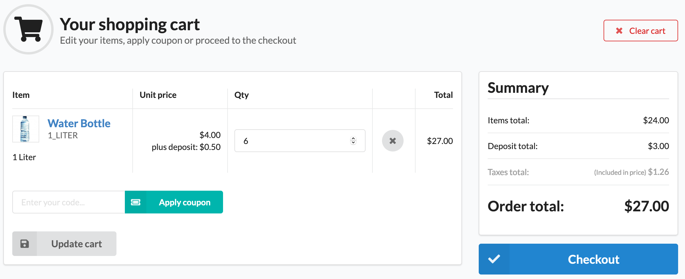

# Sylius Product Deposit Plugin

[![Latest Version on Packagist][ico-version]][link-packagist]
[![Software License][ico-license]](LICENSE)
[![Quality Score][ico-code-quality]][link-code-quality]

<a href="https://sylius.com/plugins/" target="_blank"></a>

The product deposit plugin in Sylius allows you to set an amount of refundable deposit price for any product. 
For example: deposit for bottles, cans, pallets, batteries or car replacement parts.

## Features
 * Store individual deposit prices for each product variant and channel
 * The deposit price is displayed on the product detail page
 * At shopping cart / checkout / order the total unit price inclusive deposit is displayed.

## Installation

### Download the plugin via composer
```bash
composer require gewebe/sylius-product-deposit-plugin
```

### Enable the plugin
Register the plugin by adding it to your `config/bundles.php` file

```php
<?php

return [
    // ...
    Gewebe\SyliusProductDepositPlugin\GewebeSyliusProductDepositPlugin::class => ['all' => true],
];
```

### Configure the plugin

```yaml
# config/packages/gewebe_sylius_product_deposit.yaml

imports:
    - { resource: '@GewebeSyliusProductDepositPlugin/Resources/config/app/config.yml'}
```

### Extend `ProductVariant` entity

- If you use `annotations` mapping:

```php
# src/Entity/Product/ProductVariant.php

namespace App\Entity\Product;

use Doctrine\ORM\Mapping as ORM;
use Gewebe\SyliusProductDepositPlugin\Entity\ProductVariantInterface as ProductVariantDepositInterface;
use Gewebe\SyliusProductDepositPlugin\Entity\ProductVariantDepositTrait;
use Sylius\Component\Core\Model\ProductVariant as BaseProductVariant;

/**
 * @ORM\Entity
 * @ORM\Table(name="sylius_product_variant")
 */
class ProductVariant extends BaseProductVariant implements ProductVariantDepositInterface
{
    use ProductVariantDepositTrait;

    public function __construct()
    {
        parent::__construct();

        $this->initProductVariantDepositTrait();
    }

    // ...
}
```

- If you use `yaml` mapping add also:

```yaml
App\Entity\Product\ProductVariant:
    type: entity
    table: sylius_product_variant
    manyToOne:
        depositTaxCategory:
            targetEntity: Sylius\Component\Taxation\Model\TaxCategoryInterface
            joinColumn:
                name: deposit_tax_category_id
                referencedColumnName: id
                onDelete: SET NULL
    oneToMany:
        channelDeposits:
            targetEntity: Gewebe\SyliusProductDepositPlugin\Entity\ChannelDepositInterface
            mappedBy: productVariant
            orphanRemoval: true
            indexBy: channelCode
            cascade:
                - all
```

### Update your database schema

```bash
bin/console doctrine:migrations:diff
bin/console doctrine:migrations:migrate
```

## Usage

##### 1. Add a deposit price to a product variant


##### 2. Browse a product variant with deposit price


##### 3. Buy a product with deposit price included in final product price


## Testing

Setup
```bash
$ composer install
$ cd tests/Application
$ yarn install
$ yarn run gulp
$ bin/console assets:install public -e test
$ bin/console doctrine:schema:create -e test
$ bin/console server:run 127.0.0.1:8080 -d public -e test
```

Run Tests
```bash
$ vendor/bin/behat
$ vendor/bin/phpspec run
$ vendor/bin/phpstan analyse -c phpstan.neon -l max src/
```

[ico-version]: https://img.shields.io/packagist/v/gewebe/sylius-product-deposit-plugin.svg?style=flat-square
[ico-license]: https://img.shields.io/badge/license-MIT-brightgreen.svg?style=flat-square
[ico-code-quality]: https://img.shields.io/scrutinizer/g/gewebe/SyliusProductDepositPlugin.svg?style=flat-square

[link-packagist]: https://packagist.org/packages/gewebe/sylius-product-deposit-plugin
[link-code-quality]: https://scrutinizer-ci.com/g/gewebe/SyliusProductDepositPlugin
